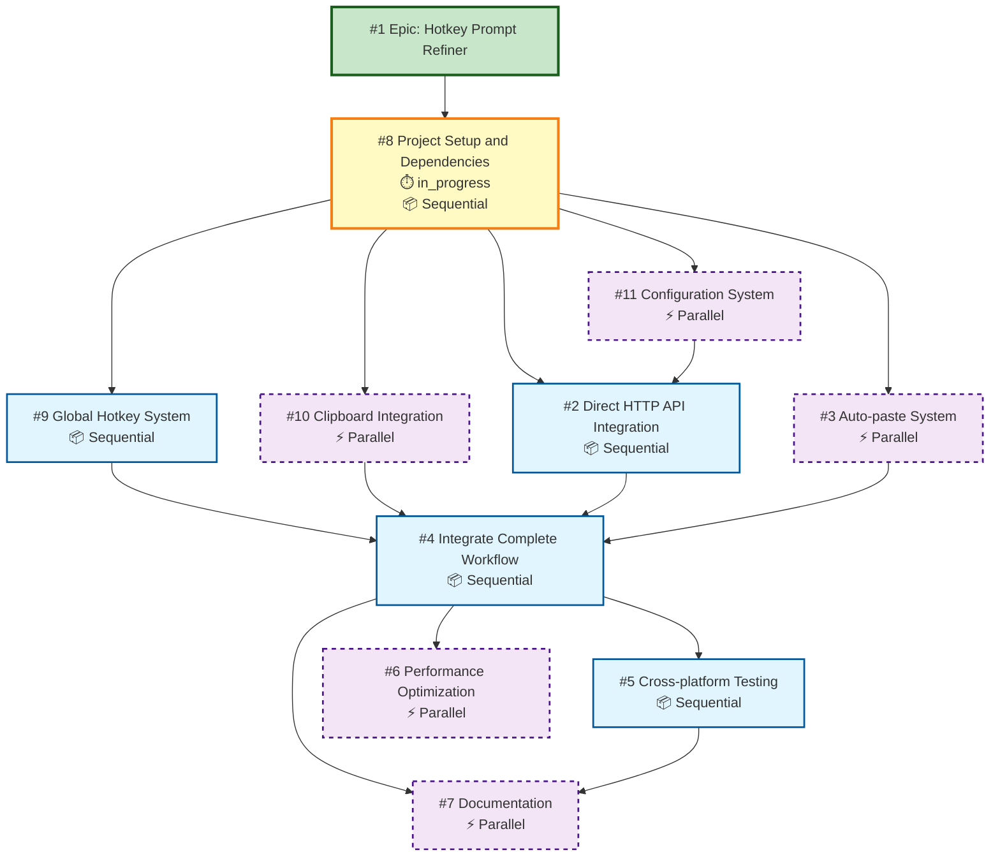

# Task Dependencies Graph

## Mermaid Diagram

## Legend

- **🟦 Sequential Tasks (solid border)**: Must be completed before dependent tasks can start
- **🟪 Parallel Tasks (dashed border)**: Can be worked on simultaneously with other parallel tasks at the same level
- **🟨 In Progress**: Currently being worked on
- **🟩 Epic**: Root task that encompasses all subtasks

## Critical Path

The critical path (longest sequence of dependencies) is:
1. #8 Project Setup and Dependencies _(in progress)_
2. #9 Global Hotkey System OR #2 Direct HTTP API Integration
3. #4 Integrate Complete Workflow
4. #5 Cross-platform Testing and Refinement
5. #7 Documentation and User Guide

**Estimated Duration:** ~49-68 hours (1.5-2 weeks)

## Parallelization Opportunities

### Phase 1: Foundation (after #8 completes)
Can work in parallel:
- #9 Global Hotkey System (sequential)
- #10 Clipboard Integration (parallel)
- #11 Configuration System (parallel)
- #3 Auto-paste System (parallel)

### Phase 2: API Integration (after #8 + #11 complete)
- #2 Direct HTTP API Integration

### Phase 3: Integration (after all core components complete)
- #4 Integrate Complete Workflow

### Phase 4: Polish (after #4 completes)
Can work in parallel:
- #5 Cross-platform Testing (sequential, but feeds into #7)
- #6 Performance Optimization (parallel)
- #7 Documentation (parallel, needs #5 for platform notes)

## Dependency Matrix

| Task | Depends On | Can Run In Parallel |
|------|-----------|---------------------|
| #8 Project Setup | - | No (foundation) |
| #9 Global Hotkey | #8 | No |
| #10 Clipboard | #8 | Yes |
| #11 Configuration | #8 | Yes |
| #2 API Integration | #8, #11 | No |
| #3 Auto-paste | #8 | Yes |
| #4 Workflow Integration | #9, #10, #2, #3 | No |
| #5 Cross-platform Testing | #4 | No |
| #6 Performance Optimization | #4 | Yes |
| #7 Documentation | #4, #5 | Yes |
